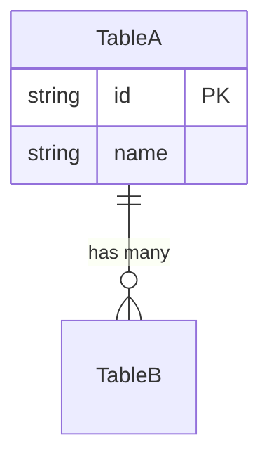

# ER図生成スキル

`web/prisma/schema.prisma` からER図を生成します。

## 実行手順

1. **schema.prisma を読み込む**: `web/prisma/schema.prisma` の内容を確認
2. **モデルとリレーションを解析**: すべてのmodel、enum、リレーションを抽出
3. **ER図を生成**: 指定されたフォーマットで生成

## 出力フォーマット

引数 `$ARGUMENTS` に基づいて出力形式を決定:
- `mermaid` - Mermaid形式のみ
- `drawio` - Draw.io形式のみ
- `both` または 引数なし - 両方の形式

## 出力先

- Mermaid: `docs/er-diagram/er-diagram.mermaid.md`
- Draw.io: `docs/er-diagram/er-diagram.drawio`

## Mermaid形式の仕様

リレーション記号:
- `||--||` : 1対1
- `||--o{` : 1対多
- `o{--o{` : 多対多

## Draw.io形式の仕様

Draw.io XML形式で出力。各テーブルをボックスとして配置し、リレーションを矢印で表現。

## 生成ルール

1. **すべてのモデルを含める**: NextAuth関連（Account, Session, VerificationToken）も含む
2. **フィールド型を明記**: String, DateTime, Int など
3. **PKとFKを明示**: 主キーには `PK`、外部キーには `FK` を付与
4. **enumは別ボックス**: enum型は独立した要素として表示
5. **リレーションラベル**: リレーション名をラベルとして表示

## 実行後

生成完了後、出力ファイルのパスを報告してください。
