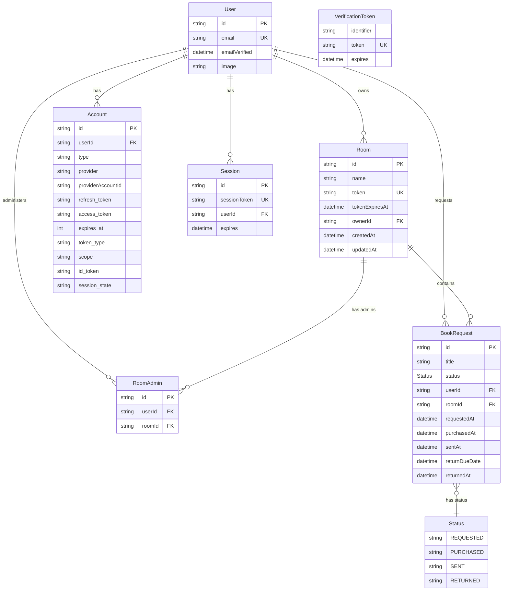

# ER Diagram - Berrow Books App

## Legend

| 記号 | 意味 |
|------|------|
| PK | Primary Key (主キー) |
| FK | Foreign Key (外部キー) |
| UK | Unique Key (一意キー) |
| `\|\|--o{` | 1対多 |
| `\|\|--\|\|` | 1対1 |
| `}o--\|\|` | 多対1 |

## Models Overview

### Business Logic
- **User**: アプリケーションユーザー
- **Room**: 書籍の保管場所
- **RoomAdmin**: 部屋の管理者（User と Room の中間テーブル）
- **BookRequest**: 書籍リクエスト

### NextAuth
- **Account**: OAuth アカウント情報
- **Session**: セッション管理
- **VerificationToken**: メール検証トークン

### Enum
- **Status**: 書籍リクエストの状態 (REQUESTED → PURCHASED → SENT → RETURNED)
